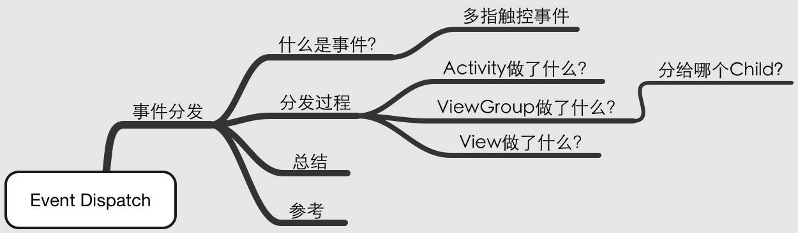
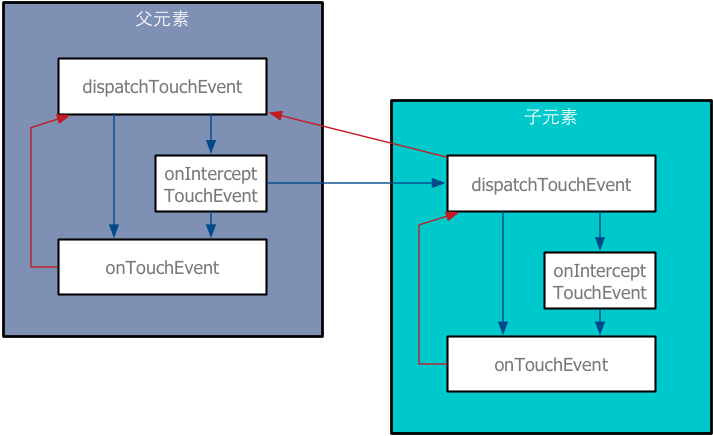

## 目录




之前自己对Android事件分发原理各个知识点理解的比较松散，有很多问题也一直没有真正搞清楚，今天用这篇文章彻底梳理一下这方面的知识, 并将最近思考的一些问题进行解决, 方便以后查看。

## 什么是事件？

首先确定一个问题, Android中有哪些事件？

不管是click, 还是double click, 或者long click等等, 归根结底就是由这三个事件组成:

**ACTION_DOWN**:手指在屏幕上落下

**ACTION_MOVE**:手指在屏幕上移动

**ACTION_UP**:手指离开屏幕

此外，还有一个特殊的事件, 叫做**ACTION_CANCEL**, 它是事件分发过程中, 当上层拦截了当前View的事件时, 给当前View发的一个通知.

当然，这是在单指触摸的情况下, 那么多指触控的事件是什么样呢?

#### 多指触控事件

其实多指触控就是增加了这样两个事件：

**ACTION_POINTER_DOWN**:当屏幕上已经有一或多个点时再按下其他点触发(第一个点触发ACTION_DOWN)

**ACTION_POINTER_UP**:当屏幕上有多个点被按住，松开其中一个点时触发(若是松开最后一个则触发ACTION_UP)

组合利用以上各事件, 就可以实现多种屏幕操作方式了.

## 分发流程

我们都知道, 当在屏幕上点下去的那一刻, 事件分发的过程是这样的:

**Activity-->PhoneWindow-->DecorView-->ViewGroup-->View**

之前没有认识到, 这是一个典型的责任链模式, 我们点击的是Activity, 它将事件逐级传递, 一直到有人能将这个事件消费掉为止.

我们还知道这个过程中有三个关键方法:

**public boolean dispatchTouchEvent(MotionEvent e)**

**public boolean onInterceptTouchEvent(MotionEvent e)**

**public boolean onTouchEvent(MotionEvent e)**

事件发生后, Activity的dispatchTouchEvent首先被调用, 按我的理解它们三个相互间的关系是这样的:



这个图体现了事件分发的基本流程, 但真的代码比这要复杂太多. 当前事件持有元素的dispatchTouchEvent会被调用, 然后通过onInterceptTouchEvent判定是否拦截这个事件, 这个方法返回true就表示它会拦截, 然后就会交给onTouchEvent处理, 如果onInterceptTouchEvent返回false, 就交给它的child元素去处理, 如此反复.当在本元素内将事件拦截时, 若onTouchEvent能处理, 那么就返回true, 告诉父级元素我处理完了, 你不用管了. 若onTouchEvent不能处理, 返回个false, 那么就需要让父级元素去处理了.

也就是说, 在这个过程中, 每一级元素都可以利用这个事件来做一些事情, 最终是否消费该事件完全靠一个dispatchTouchEvent的返回值来判断. 如果消费了该事件, 那么事件就不会继续传递下去, 如果事件一直没有被消费, 就会最终传回给Activity, 如果Activity也不管就被抛弃.

这是一个比较简单的流程, 但实际上在这个过程中还是有很多细节问题需要搞清楚.下面我们分别看看不同元素的分发过程.

#### Activity做了什么?

我们从Activity的dispatchTouchEvent开始看, 就是它:

```java
public boolean dispatchTouchEvent(MotionEvent ev) {
  if (ev.getAction() == MotionEvent.ACTION_DOWN) {
    onUserInteraction();
  }
  if (getWindow().superDispatchTouchEvent(ev)) {
    return true;
  }
  return onTouchEvent(ev);
}
```

这个onUserInteraction好像是为了在点击屏幕的时候获得第一手时间用的, 和分发关系不大. Activity似乎不拦截事件, 它直接调用了Window的dispatch, 如果被消费了, 那么分发结束, 如果没有, 那就调用自己的onTouchEvent. Activity的onTouchEvent非常简单:

```java
public boolean onTouchEvent(MotionEvent event) {
  if (mWindow.shouldCloseOnTouch(this, event)) {
    finish();
    return true;
  }

  return false;
}
```

接下来自然是进入了PhoneWindow, 在这里面调用了其内部那个DecorView的superDispatchTouchEvent方法. 点进去看, 发现它其实用的就是ViewGroup的dispatchTouchEvent.

#### ViewGroup做了什么?

ViewGroup的dispatchTouchEvent方法就比较长了, 它的执行其实是和我们上面那个图最像的, 我们来截取一下:

```java
// Handle an initial down.
if (actionMasked == MotionEvent.ACTION_DOWN) {
  // Throw away all previous state when starting a new touch gesture.
  // The framework may have dropped the up or cancel event for the previous gesture
  // due to an app switch, ANR, or some other state change.
  cancelAndClearTouchTargets(ev);
  resetTouchState();
}
```

首先Handle了一个initial down, 根据注释, ViewGroup在每一次ACTION_DOWN降临的时候做了重置, 意味着一个新的姿势开始了.

```java
// Check for interception.
final boolean intercepted;
if (actionMasked == MotionEvent.ACTION_DOWN
    || mFirstTouchTarget != null) {
  final boolean disallowIntercept = (mGroupFlags & FLAG_DISALLOW_INTERCEPT) != 0;
  if (!disallowIntercept) {
    intercepted = onInterceptTouchEvent(ev);
    ev.setAction(action); // restore action in case it was changed
  } else {
    intercepted = false;
  }
} else {
  // There are no touch targets and this action is not an initial down
  // so this view group continues to intercept touches.
  intercepted = true;
}
```

然后重点来了, 这就是ViewGroup决定是否拦截当前事件的代码. ViewGroup在两种情况下会判断是否拦截事件:1.ACTION_DOWN, 也就是新事件的开始;2.mFirstTouchTarget != null, 这是啥?

Android事件传递有个原则, 同一个事件序列只应被同一个元素拦截. 上面第二个条件中的mFirstTouchTarget指向一个元素, 若当前事件序列由子元素处理了, 那么这个对象就指向子元素, 若事件序列由当前ViewGroup处理, 那就不用管了, 直接intercepted = true.

接下来又判断了一个FLAG_DISALLOW_INTERCEPT, 可以禁止ViewGroup拦截事件, 但是为什么要有它?这个目前不大清楚. 而onInterceptTouchEvent方法直接就:

```java
public boolean onInterceptTouchEvent(MotionEvent ev) {
  return false;
}
```

这又是为什么呢? 不明白. 但是当前的主要任务是弄清执行过程, 所以先存疑吧.

```java
// Check for cancelation.
final boolean canceled = resetCancelNextUpFlag(this)
  || actionMasked == MotionEvent.ACTION_CANCEL;
```

接下来这里判断了一个ACTION_CANCEL事件, 如果为true后面的主要工作就不用进行了.

如果ViewGroup没有拦截, 那么重头戏就来了, ViewGroup要把事件传递给一个子元素, 那么问题来了, 应该给哪个子元素呢?

#### 分给哪个Child?

```java
final int childrenCount = mChildrenCount;
if (newTouchTarget == null && childrenCount != 0) {
  final float x = ev.getX(actionIndex);
  final float y = ev.getY(actionIndex);
  // Find a child that can receive the event.
  // Scan children from front to back.
  final ArrayList<View> preorderedList = buildOrderedChildList();
  final boolean customOrder = preorderedList == null
    && isChildrenDrawingOrderEnabled();
  final View[] children = mChildren;
  for (int i = childrenCount - 1; i >= 0; i--) {
    final int childIndex = customOrder
      ? getChildDrawingOrder(childrenCount, i) : i;
    final View child = (preorderedList == null)
      ? children[childIndex] : preorderedList.get(childIndex);

    // If there is a view that has accessibility focus we want it
    // to get the event first and if not handled we will perform a
    // normal dispatch. We may do a double iteration but this is
    // safer given the timeframe.
    if (childWithAccessibilityFocus != null) {
      if (childWithAccessibilityFocus != child) {
        continue;
      }
      childWithAccessibilityFocus = null;
      i = childrenCount - 1;
    }

    if (!canViewReceivePointerEvents(child)
        || !isTransformedTouchPointInView(x, y, child, null)) {
      ev.setTargetAccessibilityFocus(false);
      continue;
    }

    newTouchTarget = getTouchTarget(child);
    if (newTouchTarget != null) {
      // Child is already receiving touch within its bounds.
      // Give it the new pointer in addition to the ones it is handling.
      newTouchTarget.pointerIdBits |= idBitsToAssign;
      break;
    }

    resetCancelNextUpFlag(child);
    if (dispatchTransformedTouchEvent(ev, false, child, idBitsToAssign)) {
      // Child wants to receive touch within its bounds.
      mLastTouchDownTime = ev.getDownTime();
      if (preorderedList != null) {
        // childIndex points into presorted list, find original index
        for (int j = 0; j < childrenCount; j++) {
          if (children[childIndex] == mChildren[j]) {
            mLastTouchDownIndex = j;
            break;
          }
        }
      } else {
        mLastTouchDownIndex = childIndex;
      }
      mLastTouchDownX = ev.getX();
      mLastTouchDownY = ev.getY();
      newTouchTarget = addTouchTarget(child, idBitsToAssign);
      alreadyDispatchedToNewTouchTarget = true;
      break;
    }

    // The accessibility focus didn't handle the event, so clear
    // the flag and do a normal dispatch to all children.
    ev.setTargetAccessibilityFocus(false);
  }
  if (preorderedList != null) preorderedList.clear();
}
```

事实上, ViewGroup遍历了所有子元素, 而判断子元素能不能接收事件的因素主要就是:当前事件区域在不在这个子元素覆盖范围内.如果覆盖区域有重叠呢? 应该是加载给最上面的的元素, 也就是最后加载的那个, 所以代码中我们的Child元素是逆序遍历的.

发现一个元素可传递事件, 就会执行一个dispatchTransformedTouchEvent方法, 我们发现ViewGroup自己的处理逻辑也在这里 :

```java
// Perform any necessary transformations and dispatch.
if (child == null) {
  handled = super.dispatchTouchEvent(transformedEvent);
} else {
  final float offsetX = mScrollX - child.mLeft;
  final float offsetY = mScrollY - child.mTop;
  transformedEvent.offsetLocation(offsetX, offsetY);
  if (! child.hasIdentityMatrix()) {
    transformedEvent.transform(child.getInverseMatrix());
  }

  handled = child.dispatchTouchEvent(transformedEvent);
}
```

如果某个子元素的dispatchTouchEvent返回了true, 那么就会跳出遍历循环. 如果遍历结束也没有发现一个能处理事件的, ViewGroup就会自己处理了, 处理逻辑也在上面代码中.

因此, 对于dispatchTransformedTouchEvent这个方法, 如果ViewGroup自己拦截了, 或者Child拦截但没处理掉, 则传入Child为null, 而如果有Child处理, 则会传入一个Child. 这两种结果最终都变成了一个View中的处理过程(ViewGroup的Super也是View).

### View做了什么?

VIew就没有onInterceptTouchEvent的方法了, 它是尾巴, 没法向下继续传递事件了. 先来看看View的dispatchTouchEvent:

```java
public boolean dispatchTouchEvent(MotionEvent event) {
  // ...

  boolean result = false;

  // ...

  if (onFilterTouchEventForSecurity(event)) {
    //noinspection SimplifiableIfStatement
    ListenerInfo li = mListenerInfo;
    if (li != null && li.mOnTouchListener != null
        && (mViewFlags & ENABLED_MASK) == ENABLED
        && li.mOnTouchListener.onTouch(this, event)) {
      result = true;
    }

    if (!result && onTouchEvent(event)) {
      result = true;
    }
  }

  // ...

  return result;
}
```

可以看到, 先判断了有没有设置OnTouchListener, 如果设置了并且这个listener返回true了, 那么onTouchEvent就不会被调用了, 设计师认为外界的处理优先级要高于内部处理.

接下来进入onTouchEvent看一看, 看到它在一个大if里面switch了各种事件:

```java
public boolean onTouchEvent(MotionEvent event) {
  
  //...

  if (((viewFlags & CLICKABLE) == CLICKABLE ||
       (viewFlags & LONG_CLICKABLE) == LONG_CLICKABLE) ||
      (viewFlags & CONTEXT_CLICKABLE) == CONTEXT_CLICKABLE) {
    switch (action) {
      case MotionEvent.ACTION_UP:
        boolean prepressed = (mPrivateFlags & PFLAG_PREPRESSED) != 0;
        if ((mPrivateFlags & PFLAG_PRESSED) != 0 || prepressed) {
          
          // ...

          if (!mHasPerformedLongPress && !mIgnoreNextUpEvent) {
            // This is a tap, so remove the longpress check
            removeLongPressCallback();

            // Only perform take click actions if we were in the pressed state
            if (!focusTaken) {
              // Use a Runnable and post this rather than calling
              // performClick directly. This lets other visual state
              // of the view update before click actions start.
              if (mPerformClick == null) {
                mPerformClick = new PerformClick();
              }
              if (!post(mPerformClick)) {
                performClick();
              }
            }
          }

          if (mUnsetPressedState == null) {
            mUnsetPressedState = new UnsetPressedState();
          }

          //...

          removeTapCallback();
        }
        mIgnoreNextUpEvent = false;
        break;

      case MotionEvent.ACTION_DOWN:
		// ...
        if (isInScrollingContainer) {
          mPrivateFlags |= PFLAG_PREPRESSED;
          if (mPendingCheckForTap == null) {
            mPendingCheckForTap = new CheckForTap();
          }
          mPendingCheckForTap.x = event.getX();
          mPendingCheckForTap.y = event.getY();
          postDelayed(mPendingCheckForTap, ViewConfiguration.getTapTimeout());
        } else {
          // Not inside a scrolling container, so show the feedback right away
          setPressed(true, x, y);
          checkForLongClick(0);
        }
        break;

      case MotionEvent.ACTION_CANCEL:
        setPressed(false);
        removeTapCallback();
        removeLongPressCallback();
        mInContextButtonPress = false;
        mHasPerformedLongPress = false;
        mIgnoreNextUpEvent = false;
        break;

      case MotionEvent.ACTION_MOVE:
        drawableHotspotChanged(x, y);

        // Be lenient about moving outside of buttons
        if (!pointInView(x, y, mTouchSlop)) {
          // Outside button
          removeTapCallback();
          if ((mPrivateFlags & PFLAG_PRESSED) != 0) {
            // Remove any future long press/tap checks
            removeLongPressCallback();

            setPressed(false);
          }
        }
        break;
    }

    return true;
  }

  return false;
}
```

可以看到对四种基本事件进行了处理, 并且只要这个View是可点击的(clickable和longClickable同时为true), onTouchEvent就会返回true, 即消耗掉事件, 上级就不用处理了.

在onTouchEvent里面发现两个有趣的方法:

```java
 public boolean performClick() {
        final boolean result;
        final ListenerInfo li = mListenerInfo;
        if (li != null && li.mOnClickListener != null) {
            playSoundEffect(SoundEffectConstants.CLICK);
            li.mOnClickListener.onClick(this);
            result = true;
        } else {
            result = false;
        }

        sendAccessibilityEvent(AccessibilityEvent.TYPE_VIEW_CLICKED);
        return result;
    }
```

```java
public boolean performLongClick() {
        sendAccessibilityEvent(AccessibilityEvent.TYPE_VIEW_LONG_CLICKED);

        boolean handled = false;
        ListenerInfo li = mListenerInfo;
        if (li != null && li.mOnLongClickListener != null) {
            handled = li.mOnLongClickListener.onLongClick(View.this);
        }
        if (!handled) {
            handled = showContextMenu();
        }
        if (handled) {
            performHapticFeedback(HapticFeedbackConstants.LONG_PRESS);
        }
        return handled;
    }
```

哈哈! 找到了常用的回调函数了, 而且根据ACTION_UP的条件判断, onLongClickListener要比onClickListener优先级更高一些. 那么这两个回调既然在这里, 说明它们的运行优先级比onTouchEvent更低, 那么我们之前这几个回调函数的优先级就是:

**onTouchListener—> onTouchEvent—> onLongClickListener—> onClickListener **

这也就解释了为什么我们同时设置了onTouchListener和onClickListener, onClickListener会无效.


## 总结

1. 事件分发原理:责任链模式, 事件层层传递, 消费不了则层层回传.

2. 实际上只有ViewGroup有onInterceptTouchEvent, 但它没有onTouchEvent, 使用的是View的.

3. View没有onInterceptTouchEvent, 它要么处理, 要么返回父元素. 

4. View的onTouchEvent默认都会消耗事件, 除非它不可点击.

5. View的事件的调度优先级顺序是 onTouchListener>onTouchEvent>onLongClickListener> onClickListener.

6. 事件是否被消费由返回值决定, true 表示消费, false 表示不消费, 与是否使用了事件无关.

7. ViewGroup若不拦截事件, 则逆序遍历子元素传递事件.

8. 同一个事件序列是指从手指接触屏幕时, 到手指离开屏幕的过程中所产生的事件. 一个触摸事件序列中的事件应被同一个元素消费，要么从ACTION_DOWN开始接管, 要么就不要管.

9. ViewGroup的onIntercepTouchEvent默认是不拦截任何事件的, 所以直接返回false.

   ​

## 参考

[Android 事件分发机制详解](https://www.diycode.cc/topics/352)

[安卓自定义View进阶-事件分发机制原理](http://www.gcssloop.com/customview/dispatch-touchevent-theory)

[Android开发艺术探索]()