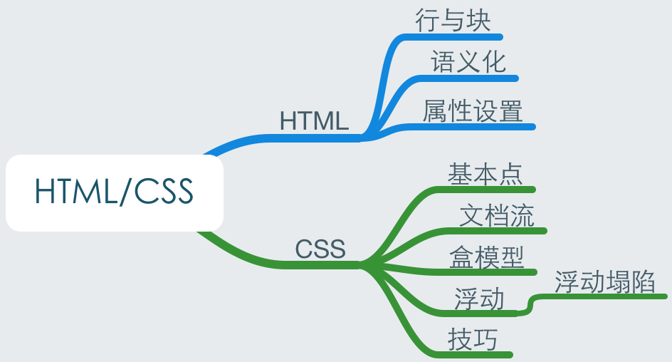
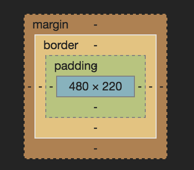
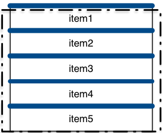

前端之前了解的略少, 最近在leader的指导下学习了很多知识, 有些是之前知道但理解不够具体的, 有些是新的知识, 想了一下决定今天做个总结, 复习巩固, 避免再丢了.

## 目录



## HTML

之前认为写HTML就是堆标签, 和Android的XML布局文件差不多, 其实还是有很多东西. 首先HTML没有像Android那样定义一些结构化的标签, 比如Linerlayout, RelativeLayout等, 通过ViewGroup包裹View呈现页面, 然后XML解析与逻辑控制都在主进程里做. HTML与Android不同, 它的核心是HTML文件本身, 浏览器先读取HTML文件, 再去看它用了什么css与js. 

### 行与块

块元素就像段落, 行内元素就像单词. 它们 一个按行显示, 一个在同行显示.

常见块元素有: div, p, h1, ul, ol, li, table, form 和 body 等.	

常见的内联行元素有: span, input, select, a, img, em, strong 等. 

还有一种可变元素, 它们根据上下文关系确定是块元素或者内联元素. 这种元素有: button, del, map, script, object等. 

所有元素里面都是可以放置子元素的. 但是行元素里是不能再放块元素的. 

### 语义化

HTML讲究语义化, 我的理解就是不要瞎写. 我们应该根据结构的设计, 选择合适的标签, 让别人更容易理解, 让浏览器更容易解析. 为了图方便大量堆div和span的做法是不可取的. 并且HTML5新增了一批语义标签, header, footer, nav什么的.

那么怎样做到语义化呢? 首先当然是尽量少用div和span. 然后, 不用纯粹的样式标签, 比如b, br, font, u等, 这些应该交给css去做. 

但有些时候为了浏览器版本的兼容, 需要弃用一些标签, 而使用div代替. 还有就是为了方便控制样式, 一些按钮比如input或者button标签常常被a代替. 

### 属性设置

每个元素都有属性, 我觉得可以根据前端开发的四个部分, 把HTML标签的属性分为4种: 标识属性, 内容属性, 样式属性, 事件属性. 

标识属性就是class, id, name等, 这些属性可以帮助css与js定位控制的元素标签. 如果把一个标签看成一个类, 那么标签名就是个基类名, class是实现类名, 而id可看做唯一的对象的标识.  

标识类属性也是我们再HTML文件里主要会写的属性, 由于它们是为了让CSS或JS来找我们HTML中的"类"或者"对象"用的, 所以它们的命名就要讲究一定的原则, 就是应该描述功能, 而不是结构. 结构我们的HTML自己负责了, 而交给CSS或JS后, 它们是不关心结构的, 它们共同关心的东西就是这个区域是干什么用的, 它的特性是什么, 所以应该以这个来命名标识. 

而其他属性, 如内容属性, 比如a标签的href, 一些input的value等, 这些就是一些可变的东西. 样式属性不能在HTML里面写, 统一由CSS负责完成. 事件属性就相当于调用接口, 具体操作就交给了js处理.

此外, 还有一点应该记住, 就是不要滥用id. 因为id是唯一标识, 只有在我们需要唯一定位一个东西的时候才使用它, 如果

## CSS

在动手设计样式的时候, 常常有想法与实际效果大不相同的体会, 所以css还是需要多加练习, 只看懂文档中的内容还是远远不够的.

### 基本点

首先总结一下写css的原则问题, CSS应该是负责页面样式的管家, 它的存在应该让HTML完全不用管样式是什么样的, 只一心处理好结构就行了.

CSS在写的时候需要定位用到具体元素上的, 可以是元素, 或者具体class, 或者具体id, 甚至具体属性. 在写的时候完全可以直接指定一个标识, 把样式定义好. 但是这么做是有问题的, 首先CSS有个优先级覆盖的问题, 如果这个文件不是一个人在写, 那就得保证你写的样式不会覆盖别人的. 

CSS中越具体的定位其样式优先级越高, 这样一来, 如果让全部属于某个类的标签都应用这个属性:

```css
.slogan { coloer: blue; width: 100%; font-size: larger; background: #000; }
```

那么, 如果别人还有这样一个属性:

```css
#container .slogan { color: red; margin-top: 15px; }
```

他的color仍会是红色, 但是你的属性包含了他没有的属性, 他的slogan背景会变成黑色, 这是不应该发生的. 

所以如果我想给我的一个东西设置一个样式, 那么应该使用后代选择器去做一个尽量具体的定义.

### 文档流

HTML文件有一个文档流的概念, 按照从上到下, 从左到右的规则把一个一个的块级元素与行级元素呈现到页面上.在没有浮动起来的情况下, 每个块级元素都是一行, 如果浮动了, 就一个一个怼到行的左端或者右端, 这就叫做"脱离文档流". 此外, 通过绝对和相对定位也是会使元素脱离文档流的. 相对定位后不会消除占位, 它原来的位置上还保留有它的空间, 因为它的位置是相对于它当前在文档流中的位置决定的. 而绝对定位不是, 它会把元素"真正地"移动到相对于离自己最近的已定位祖先元素的某一位置上. 

### 盒模型

这个就是盒模型:



包括margin, border, padding和内容, 很简单. 根据这个盒模型, 我们在设置一个元素样式的时候就要考虑这个模型中各部分, 这样就不会生出"我设置的宽度不是这样的呀?"的感觉了. 

**盒子在标准流中的定位原则** 

（1）行内元素之间的水平margin 

当两个行内元素紧邻时，它们之间的距离为第1个元素的margin-right加上第2个元素的margin-left。 

（2）块级元素之间的竖直margin 

当两个块级元素紧邻时，它们的距离不是margin-bottom与margin-top的总和，而是两者中的较大者。 

（3）嵌套盒子之间的margin 

当一个div块包含在另一个div块中时，便形成了典型的父子关系。其中子块的margin将以父块的 content为参考。 

（4）将margin设置为负值 

当margin设置为负值时，会使被设为负数的块向相反的方向移动，甚至覆盖在另外的块上。

### 浮动

CSS可以让HTML中的元素浮动起来, 这种定位方式有点吊. 块和行元素都可以浮动, 当一个元素（无论是块级元素还是内联元素）设置了浮动，它就会被默认为**display:inline-block（行内块级元素）**，也就是说浮动会让元素变为拥有块级属性的行内元素.

浮动可以清除, 属性clear可以设置为left, right, both, 规定左右两边是否允许有浮动的元素存在, 概念很好理解, 但是这个清除用起来让人费解. 我让两个块都向左浮动, 给第一个块设置个clear: right, 发现第二个块还是浮在它右边, 它怎么不听我话呢?

实际上, clear这个属性操作的范围只限于当前元素本身, 也就是左边第一个块想让右边的块下去, 它是做不到的, 而如果是向右浮动就可以了. 这个意思就是, 当给一个元素设置了clear, 那么它就会在条件允许的情况下**自己对自己**做出调整, 而如果它管不了, 就不会有任何变化.

#### 浮动塌陷

一个元素float了, 如果它的父元素中没有其他正常文档流的元素, 父元素的的高度就变成0了, 这就是浮动塌陷. 解决塌陷有三个方法:

​	1.在父元素结束前加一个高为0宽为0且有clear:both样式的div;

​	2.父元素添加overflow:hidden;

  	3.创建一个display:block的无内容after伪对象clear: both;

我的理解是三种方法都是一个目的, 即给float元素后面加一个小东西, 让它clear: both, 这样它就自动换行了, 就撑起了父元素.

### 技巧

最近leader教了我一个布局的技巧, 就是在处理一些显示的问题的时候, 采用"移出可视区域"的办法, 比如说我想让一个list每两个item之间有一个线, 但是如果每个都加的话要么上面多一条线, 要么下面多一条线, 怎么处理? 可以这样:



画的不是很准确, 意思就是给每个item都设置了border-top, 但是又给整体设置了一个负的margin, 正好把多余的那个border移出去, 然后给父级元素设置一个overflow: hidden, 这样移出去的就也不会显示. 如果换成横的, 也是一样的意思.

其实这个技巧告诉我们的是一个道理: 处理布局, 要不拘一格, 不要拘泥于常规的方式, 应该大胆采用一些特殊的手段来实现需要的页面效果.